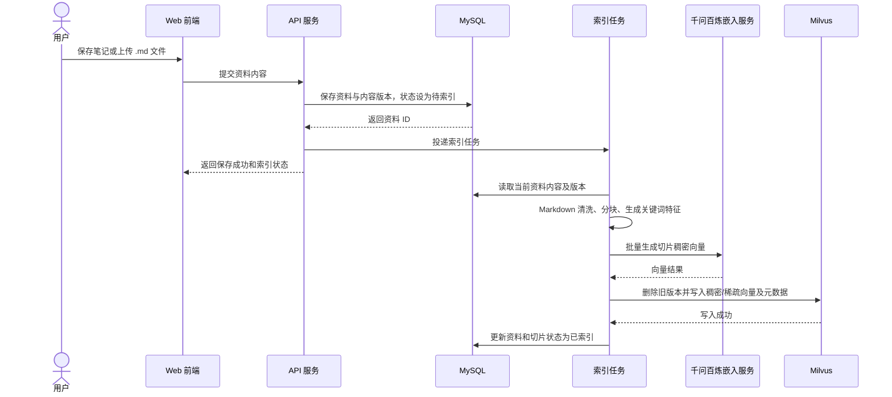
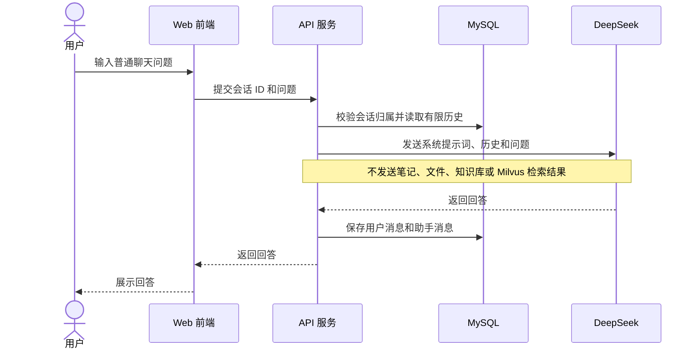
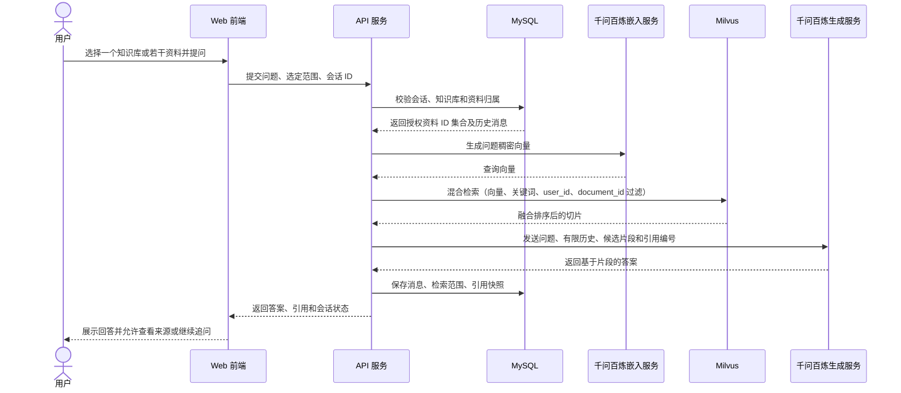
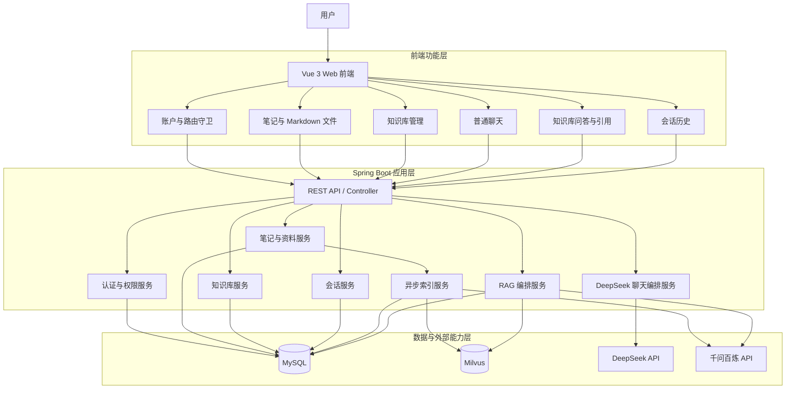
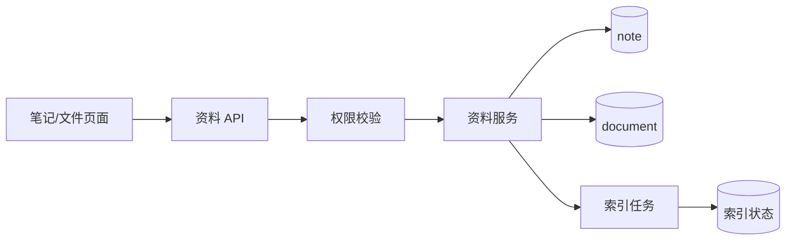
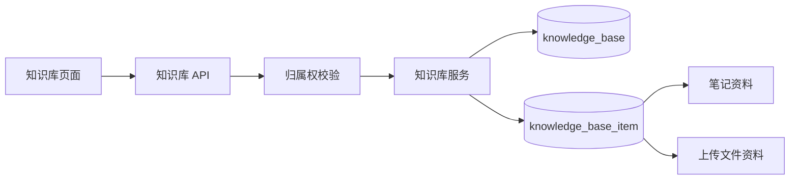
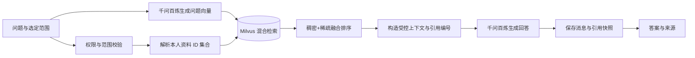
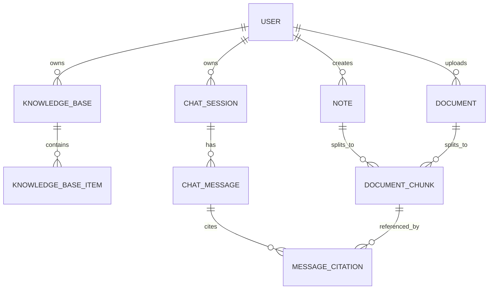

# 备忘录与个人知识库问答系统需求分析

## 1. 文档信息

| 项目 | 内容 |
| --- | --- |
| 项目名称 | 备忘录与个人知识库问答系统 |
| 文档目的 | 明确产品范围、需求模型、技术边界和验收口径，为后续设计、开发与测试提供依据。 |
| 目标用户 | 需要编写 Markdown 笔记，并以个人资料进行可信问答的注册用户。 |
| 文档版本 | V1.0 |
| 状态 | 已评审 |

## 2. 项目概述

本系统是一款自托管、以 Markdown 为核心的个人笔记软件。用户可创建和管理笔记，也可上传 Markdown 文件；两类资料均可被编入一个或多个知识库。

系统提供两条相互隔离的 AI 能力：

- **普通聊天**：调用 DeepSeek，根据聊天上下文生成回答，不访问用户笔记、文件或知识库。
- **知识库问答**：用户每次选择一个知识库或若干资料后，系统仅在该范围内使用 Milvus 混合检索召回资料片段，并调用千问百炼生成带引用的回答；会话、检索范围和引用快照均可回看与续聊。

### 2.1 目标

1. 让用户以 Markdown 低成本沉淀和管理个人资料。
2. 让用户精确控制每次知识库问答可访问的资料范围。
3. 以语义和关键词混合检索提高资料召回质量，并向用户提供可追溯的来源。
4. 让普通聊天与知识库问答的模型、数据范围和会话记录完全隔离。

### 2.2 范围与非目标

| 范围内 | 非目标 |
| --- | --- |
| 账户认证、个人资料隔离 | 未登录匿名问答 |
| Markdown 笔记创建、编辑、归档、标签与搜索 | 富文本编辑器 |
| 上传、查看、删除 Markdown 文件 | PDF、Word、图片、音视频等文件解析 |
| 知识库及其成员管理 | 知识库公开分享、多人协同编辑 |
| DeepSeek 普通聊天 | 将普通聊天自动关联个人资料 |
| 千问百炼 RAG 问答、引用与续聊 | 未提供来源的知识库回答 |
| Milvus 混合检索与索引同步 | 跨用户检索或训练用户私有模型 |

## 3. 角色与权限

| 角色 | 权限 |
| --- | --- |
| 访客 | 注册、登录；不可访问任何私有资料或 AI 会话。 |
| 注册用户 | 管理本人笔记、上传文件、知识库和会话；发起普通聊天及知识库问答。 |
| 系统服务 | 在服务端校验身份、维护索引、调用模型服务；不向模型服务发送未被本次请求授权的资料。 |

**数据隔离原则**：任意读写操作均以当前登录用户 ID 为边界。客户端传入的资源 ID 不构成授权；服务端必须验证资源、知识库、会话及引用均属于当前用户。

## 4. 需求建模

### 4.1 用例图

### 4.2 用例说明

| 编号 | 用例 | 前置条件 | 基本结果 |
| --- | --- | --- | --- |
| UC-01 | 管理笔记 | 用户已登录 | 用户可新建、编辑、删除、置顶、归档、打标签、搜索和预览 Markdown 笔记。 |
| UC-02 | 管理 Markdown 文件 | 用户已登录 | 用户仅可上传 `.md` 文件，可查看、删除并将其加入知识库。 |
| UC-03 | 管理知识库 | 用户已登录 | 用户可创建、重命名、删除知识库，并维护其中的笔记和文件；一个资料可加入多个知识库。 |
| UC-04 | 普通聊天 | 用户已登录 | 系统使用 DeepSeek 返回多轮对话答案，不执行检索且不传递用户资料。 |
| UC-05 | 知识库问答 | 用户已登录，所选资料已完成索引 | 系统在用户选定的一个知识库或若干资料中混合检索，使用千问百炼返回带引用的答案。 |
| UC-06 | 追问与回看 | 已存在本人会话 | 用户可查看消息、检索范围和引用快照，并基于该会话继续提问。 |
| UC-07 | 索引同步 | 笔记或文件发生有效内容变更 | 系统对资料进行切片、向量化和稀疏索引，更新 Milvus 中对应片段。 |

### 4.3 资料入库与索引同步时序图

### 4.4 普通聊天时序图

### 4.5 知识库问答与追问时序图

## 5. 功能需求

### 5.1 账户与访问控制

| 编号 | 需求 |
| --- | --- |
| FR-AUTH-01 | 系统应支持用户名和密码注册、登录，以及基于 JWT 的会话认证。 |
| FR-AUTH-02 | 密码必须使用 BCrypt 等不可逆算法存储；密钥和数据库密码仅能从服务端环境变量读取。 |
| FR-AUTH-03 | 除注册、登录和健康检查外，所有业务接口均需认证。 |
| FR-AUTH-04 | 服务端必须按当前用户 ID 校验所有笔记、文件、知识库、会话和引用的归属权。 |

### 5.2 笔记与 Markdown 文件

| 编号 | 需求 |
| --- | --- |
| FR-DOC-01 | 用户可创建、编辑、查看、删除、置顶、归档及搜索 Markdown 笔记。 |
| FR-DOC-02 | 用户可为笔记增加、移除和筛选标签。 |
| FR-DOC-03 | 用户仅可上传 `.md` 扩展名的文件；服务端应校验 MIME 类型、扩展名、大小和内容编码。 |
| FR-DOC-04 | 上传文件应保留原始文件名、正文、大小、创建时间、内容版本及索引状态。 |
| FR-DOC-05 | 笔记或文件的正文发生变更后，系统必须创建新的索引任务；删除资料后必须删除其 Milvus 向量及关联关系。 |
| FR-DOC-06 | Markdown 渲染必须关闭原始 HTML 或经过白名单净化，防止 XSS。 |

### 5.3 知识库管理

| 编号 | 需求 |
| --- | --- |
| FR-KB-01 | 用户可创建、重命名、删除仅属于自己的知识库。 |
| FR-KB-02 | 用户可将本人笔记和 Markdown 文件加入或移出知识库。 |
| FR-KB-03 | 同一资料可以被加入多个知识库；修改知识库成员关系不应重复写入资料向量。 |
| FR-KB-04 | 删除知识库仅删除知识库及成员关系，不删除原始笔记、文件或其向量索引。 |
| FR-KB-05 | 知识库问答前，用户可选择一个知识库，或直接选择多个本人资料；两种范围不可混入其他用户资源。 |

### 5.4 AI 会话与知识库问答

| 编号 | 需求 |
| --- | --- |
| FR-AI-01 | 系统必须将普通聊天和知识库问答保存为类型不同的会话，且在界面与接口层分开呈现。 |
| FR-AI-02 | 普通聊天必须调用 DeepSeek，不得自动读取或检索用户资料。 |
| FR-AI-03 | 知识库问答必须调用千问百炼：其嵌入模型用于生成查询和资料切片的稠密向量，生成模型用于基于召回片段组织答案。 |
| FR-AI-04 | 每次知识库问答必须显式提交一个知识库或至少一项资料；没有选定范围时不得执行检索。 |
| FR-AI-05 | 系统只能检索本次授权范围内、状态为“已索引”的资料。 |
| FR-AI-06 | 回答必须返回来源列表，至少包含资料名称、资料类型、片段内容、片段位置和相关度。 |
| FR-AI-07 | 每轮知识库问答必须保存用户问题、回答、授权资料范围、检索版本、引用快照及创建时间。 |
| FR-AI-08 | 继续追问时可读取同一会话中有限数量的历史消息，但仍必须基于该轮用户选择的范围重新校验权限并重新检索。 |
| FR-AI-09 | 未检索到可靠片段时，系统必须明确说明未找到依据，不得伪造资料出处。 |

## 6. 功能架构

### 6.1 完整功能架构图

### 6.2 子图一：笔记与资料管理

**职责**：`note` 保存用户创建笔记；`document` 保存上传 Markdown 文件。两者在问答中统一映射为可索引资料，但保留不同的创建和展示方式。

### 6.3 子图二：知识库管理

**职责**：知识库是资料的逻辑集合。成员关系存于 MySQL，问答时先解析为资料 ID 集合，再作为 Milvus 的标量过滤条件，因此成员变化不需要复制向量。

### 6.4 子图三：DeepSeek 普通聊天

**约束**：此链路不得调用资料服务、索引服务、Milvus 或知识库 API。

### 6.5 子图四：Milvus 混合检索知识库问答

## 7. Milvus 混合检索设计

### 7.1 检索策略

系统对每个 Markdown 资料切片，同时维护下列索引：

| 索引 | 内容 | 用途 |
| --- | --- | --- |
| 稠密向量 | 千问百炼嵌入模型生成的语义向量 | 召回语义相近、措辞不同的内容。 |
| 稀疏向量 | 由分词/关键词特征生成的稀疏表示 | 精确匹配术语、专有名词、版本号和代码标识。 |
| 标量字段 | `user_id`、`document_id`、`chunk_id`、`content_version`、状态等 | 强制租户隔离、限定本次资料范围与定位引用。 |

查询时，系统先从 MySQL 解析当前用户有权访问的 `document_id` 集合；再以 `user_id = 当前用户` 且 `document_id in 授权集合` 作为 Milvus 过滤表达式。随后对稠密与稀疏检索结果使用加权融合排序；可在性能和质量验证后增加重排模型。

### 7.2 索引流程

1. 对笔记正文或上传的 Markdown 文件进行编码标准化、去除无效空白并保留标题层级。
2. 按标题和段落优先切片；超长段落再按固定窗口切分，并保留适度重叠及字符位置。
3. 为切片生成 `chunk_id`、`document_id`、标题路径、字符区间、内容版本和内容哈希。
4. 调用千问百炼嵌入模型写入稠密向量，并生成稀疏特征写入 Milvus。
5. 写入成功后，将资料索引状态更新为“已索引”；任一步失败则标记“索引失败”，保存失败原因并支持重试。

### 7.3 一致性与删除规则

| 事件 | MySQL 行为 | Milvus 行为 |
| --- | --- | --- |
| 新建资料 | 保存资料，状态为待索引 | 写入新切片后才标记已索引。 |
| 修改正文 | 递增内容版本，状态为待索引 | 用新版本切片替换旧版本；查询仅过滤当前版本。 |
| 删除资料 | 软删除或删除资料记录及关联 | 删除该资料所有切片。 |
| 加入/移出知识库 | 更新成员关系 | 不修改向量；查询时动态解析资料范围。 |
| 索引任务失败 | 记录失败状态和原因 | 保留旧版本但不作为当前版本检索结果。 |

### 7.4 RAG 提示词约束

- 仅将混合检索后排名靠前且通过阈值的片段提供给千问百炼生成模型。
- 提示词要求回答严格基于提供片段；资料不足时回答“未在选定资料中找到依据”。
- 每个片段使用稳定引用编号，模型回答中的引用必须映射到服务端保存的 `message_citation` 快照。
- 不将 API Key、用户身份凭据、未授权资料或无关会话内容传给模型服务。

## 8. 数据模型

### 8.1 核心实体

| 实体 | 关键字段 | 说明 |
| --- | --- | --- |
| `user` | `id`、`username`、`password_hash` | 用户账户。 |
| `note` | `id`、`user_id`、`title`、`content`、`content_version`、`index_status`、`index_error`、`retry_count` | 用户创建的 Markdown 笔记。 |
| `document` | `id`、`user_id`、`file_name`、`content`、`content_version`、`index_status`、`index_error`、`retry_count` | 用户上传的 Markdown 文件。 |
| `knowledge_base` | `id`、`user_id`、`name` | 用户私有知识库。 |
| `knowledge_base_item` | `knowledge_base_id`、`resource_type`、`resource_id` | 知识库与笔记/文件的多对多关系。 |
| `document_chunk` | `id`、`user_id`、`resource_type`、`resource_id`、`content_version`、`chunk_index`、`content`、`position_start`、`position_end`、`content_hash` | MySQL 中的切片定位与索引管理记录。 |
| `chat_session` | `id`、`user_id`、`mode`、`title` | 会话；`mode` 为 `chat` 或 `rag`。 |
| `chat_message` | `id`、`session_id`、`role`、`content`、`selected_scope` | 每轮用户/助手消息及问答选择范围。 |
| `message_citation` | `message_id`、`chunk_id`、`content_snapshot`、`ordinal` | 回答引用的不可变快照。 |

### 8.2 实体关系图

## 9. 接口与集成边界

### 9.1 接口分组

| 分组 | 示例接口 | 说明 |
| --- | --- | --- |
| 认证 | `POST /api/auth/register`、`POST /api/auth/login` | 注册登录与令牌签发。 |
| 笔记 | `/api/notes` | 笔记 CRUD、标签、归档和置顶。 |
| 文件 | `POST /api/documents`、`GET /api/documents` | 仅 Markdown 文件的上传和管理。 |
| 知识库 | `/api/knowledge-bases` | 知识库 CRUD 和成员关系维护。 |
| 会话 | `/api/chat/sessions` | 会话列表、详情、删除和续聊。 |
| 普通聊天 | `POST /api/chat/sessions/{id}/messages` | DeepSeek 普通聊天。 |
| 知识库问答 | `POST /api/rag/sessions/{id}/messages` | 提交问题、知识库 ID 或资料 ID 列表，返回回答与引用。 |
| 索引 | `POST /api/documents/{id}/reindex` | 手动重试索引；仅允许资料所有者调用。 |

### 9.2 第三方服务边界

| 服务 | 用途 | 安全要求 |
| --- | --- | --- |
| DeepSeek | 普通聊天生成 | 仅发送普通聊天历史和问题。 |
| 千问百炼 | 文档/问题向量化及 RAG 答案生成 | 仅发送本次获授权的片段、有限会话历史和问题。 |
| Milvus | 稠密与稀疏向量混合检索 | 每次查询必须包含用户和资料范围过滤条件。 |

服务端通过模型适配层封装 DeepSeek 与千问百炼的 API 调用。模型名称、基础 URL、超时、重试次数和密钥均通过环境变量或受控配置注入，禁止由前端传入或写入仓库。

## 10. 异常处理与非功能要求

### 10.1 异常处理

| 场景 | 系统行为 |
| --- | --- |
| 未登录或令牌失效 | 返回 401，前端跳转登录页。 |
| 访问他人资源 | 返回 403，不泄露资源是否存在。 |
| 文件不是 Markdown 或超过限制 | 返回参数错误，不创建资料或索引任务。 |
| 所选范围为空或资源未索引 | 阻止发起 RAG 请求，并提示用户选择已索引资料。 |
| 检索无结果 | 返回可保存的回答，明确说明未找到依据，引用列表为空。 |
| Milvus 或模型服务超时 | 返回可重试错误；已保存的用户问题可保留为草稿或失败消息。 |
| 索引失败 | 资料显示索引失败状态，允许用户重试；失败资料不纳入问答。 |

### 10.2 非功能要求

| 分类 | 要求 |
| --- | --- |
| 安全 | 密钥不出服务端；按用户隔离数据；Markdown 防 XSS；日志不记录密码、令牌和完整敏感提示词。 |
| 可追溯性 | RAG 每轮保存范围、片段版本和引用快照；资料后续修改不得破坏历史引用展示。 |
| 性能 | 索引异步执行，不阻塞笔记保存和文件上传；问答仅向模型发送有限历史和经排序的少量片段。 |
| 可靠性 | 模型调用设置超时、有限重试和明确降级提示；索引任务需具备幂等性。 |
| 可观测性 | 记录请求 ID、模型调用耗时、检索命中数、索引状态和失败原因，不记录敏感原文。 |
| 可维护性 | Controller、Service、Mapper 单向分层；使用 DTO/VO；外部模型和 Milvus 均经独立适配器访问。 |

## 11. 验收标准

| 编号 | 验收项 | 通过标准 |
| --- | --- | --- |
| AC-01 | 笔记与文件 | 用户可创建 Markdown 笔记、上传 `.md` 文件，并只能查看和删除自己的资料。 |
| AC-02 | 知识库 | 用户可把笔记和文件加入多个知识库；删除知识库后原始资料仍存在。 |
| AC-03 | 索引 | 新增、修改、删除资料后，索引状态正确变化，Milvus 中无过期可查询版本。 |
| AC-04 | 混合检索 | 给定包含精确术语和同义描述的资料，检索同时利用关键词与语义向量，并只返回本次选定范围的切片。 |
| AC-05 | 知识库问答 | 选择知识库或多个资料后，系统调用千问百炼，答案包含可打开的来源及片段。 |
| AC-06 | 无依据回答 | 所选范围不包含问题依据时，系统明确说明未找到依据，不展示伪造引用。 |
| AC-07 | 普通聊天隔离 | 普通聊天调用 DeepSeek；调用记录和请求体不包含笔记、文件、知识库或 Milvus 结果。 |
| AC-08 | 历史与追问 | 用户可回看两类会话并继续追问；历史 RAG 回答可显示当时保存的引用快照。 |
| AC-09 | 权限 | 使用其他用户的任意资源、知识库或会话 ID 均无法获得数据或触发检索。 |

## 12. 实施优先级

| 阶段 | 内容 | 完成标志 |
| --- | --- | --- |
| P0 | 认证、笔记 CRUD、Markdown 文件上传、资料归属校验 | 用户可安全管理个人资料。 |
| P1 | 知识库管理、切片与 Milvus 稠密/稀疏索引、索引状态 | 选定资料可被稳定混合检索。 |
| P1 | DeepSeek 普通聊天、千问百炼 RAG、引用和会话保存 | 两类 AI 能力可用且数据隔离。 |
| P2 | 索引重试、检索质量调优、重排与可观测性 | 系统具备稳定运营和优化能力。 |
